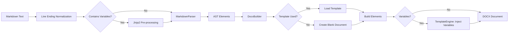
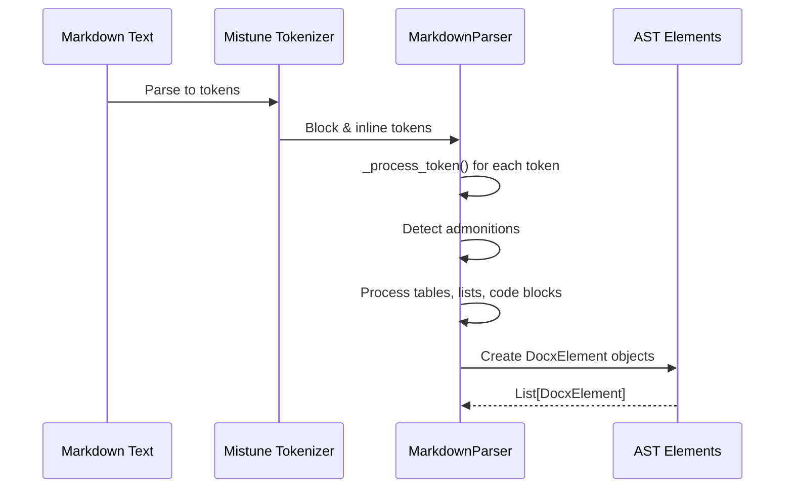
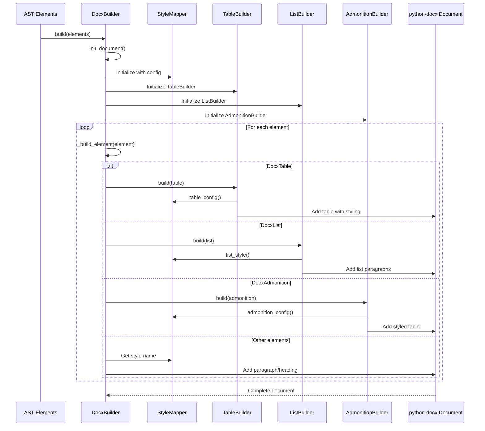
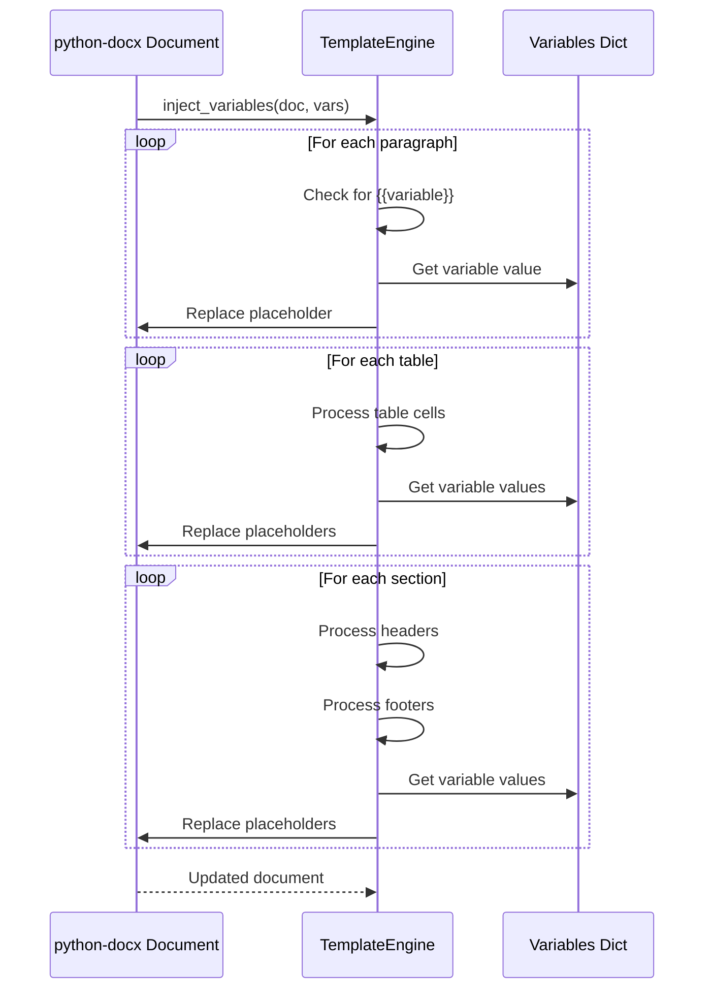
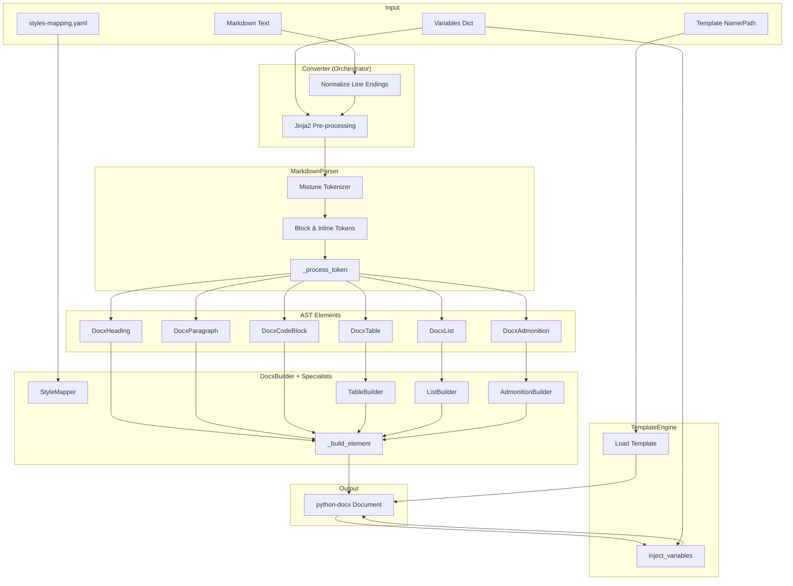
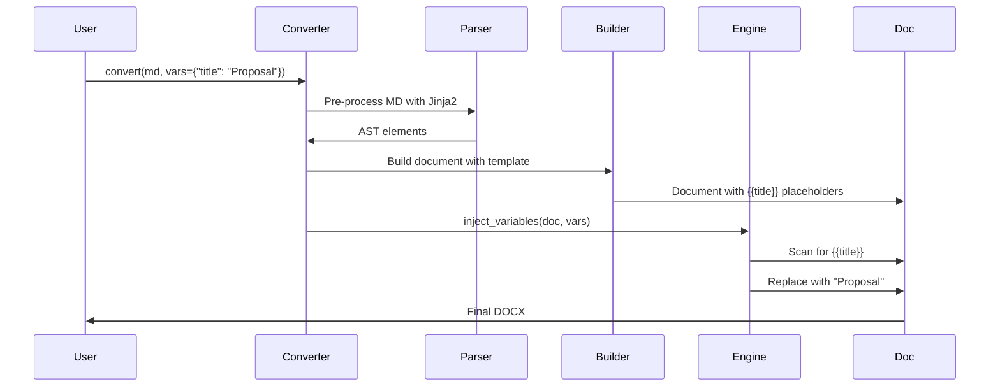

# Architecture Documentation

**Version 0.1.0**

This document describes the internal architecture of md2office, explaining the conversion pipeline, key classes, data flow, and AST element structure.

## Table of Contents

1. [Overview](#overview)
2. [Conversion Pipeline](#conversion-pipeline)
3. [Data Flow Diagram](#data-flow-diagram)
4. [Key Components](#key-components)
5. [AST Element Reference](#ast-element-reference)
6. [Style Mapping System](#style-mapping-system)
7. [Template System](#template-system)

---

## Overview

md2office converts Markdown files to Word (DOCX) documents using a multi-stage pipeline:

1. **Parsing**: Markdown text → AST elements
2. **Template Processing**: Variable injection and template loading
3. **Building**: AST elements → Word document

The architecture separates concerns:
- `parser/` handles Markdown tokenization and AST generation
- `builder/` constructs Word documents from AST elements
- `template/` manages template loading and variable injection
- `core/` orchestrates the pipeline

---

## Conversion Pipeline

The conversion process follows this sequence:



### Stage 1: Markdown Parsing



**Key steps:**
1. Mistune tokenizes Markdown into block and inline tokens
2. `MarkdownParser._process_token()` converts each token to a `DocxElement` subclass
3. Special handling for admonitions (GitHub-style `> [!NOTE]` syntax)
4. Nested structures (lists, tables) are recursively processed
5. Returns a list of `DocxElement` objects (the AST)

### Stage 2: Document Building



**Key steps:**
1. `DocxBuilder.build()` initializes a Word document (blank or from template)
2. For each AST element, `_build_element()` dispatches to specialized builders
3. `StyleMapper` resolves Word style names with fallback chains
4. Specialized builders (`TableBuilder`, `ListBuilder`, `AdmonitionBuilder`) handle complex elements
5. Returns a `python-docx` Document object

### Stage 3: Template Processing



**Key steps:**
1. `TemplateEngine.inject_variables()` scans document for `{{variable}}` placeholders
2. Processes body paragraphs, tables, headers, and footers
3. Replaces placeholders with values from variables dictionary
4. Preserves formatting of the first run in each paragraph
5. Returns the modified document

---

## Data Flow Diagram

### Complete Pipeline



---

## Key Components

### Converter

**File**: `src/md2office/core/converter.py`

**Purpose**: Orchestrates the entire Markdown to DOCX conversion pipeline.

**Key Methods**:
- `convert(markdown, output_path, variables)` - Main conversion method
- `convert_file(input_path, output_path, variables)` - Convert from file
- `_get_template_path()` - Resolve template path with fallback logic

**Workflow**:
1. Merge default and provided variables
2. Normalize line endings
3. Pre-process Markdown with Jinja2 if variables present
4. Parse Markdown to AST using `MarkdownParser`
5. Build DOCX using `DocxBuilder` with optional template
6. Inject variables using `TemplateEngine` if applicable
7. Save or return document

**Example**:
```python
converter = Converter(
    template_name="linagora",
    variables={"title": "Proposal"}
)
result = converter.convert_file("input.md", "output.docx")
```

---

### MarkdownParser

**File**: `src/md2office/parser/markdown_parser.py`

**Purpose**: Converts Markdown text to intermediate AST representation using mistune as tokenizer.

**Key Methods**:
- `parse(markdown_text)` - Parse Markdown to AST elements
- `_process_token(token)` - Convert single token to DocxElement
- `_process_heading(token)` - Process heading with anchor generation
- `_process_blockquote(token)` - Detect and process admonitions
- `_process_table(token)` - Process tables with merge markers
- `_process_list(token)` - Process nested lists
- `_process_inline_tokens(tokens)` - Convert inline formatting to TextSpans

**Special Features**:
- **Admonition Detection**: Detects GitHub-style `> [!NOTE]` syntax in blockquotes
- **Anchor Generation**: Creates URL-safe slugs from heading text for internal links
- **Merge Markers**: Recognizes `^^` (merge up) and `>>` (merge left) in table cells
- **Nested Structures**: Recursively handles nested lists and blockquotes

**Token Processing Flow**:
```
Token Type        → Method                  → AST Element
─────────────────────────────────────────────────────────
heading          → _process_heading()      → DocxHeading
paragraph        → _process_paragraph()    → DocxParagraph
block_code       → _process_code_block()   → DocxCodeBlock
block_quote      → _process_blockquote()   → DocxAdmonition or DocxBlockquote
list             → _process_list()         → DocxList
table            → _process_table()        → DocxTable
thematic_break   → (direct)                → DocxHorizontalRule
```

**Example**:
```python
parser = MarkdownParser()
elements = parser.parse("# Hello\n\nThis is a **test**.")
# Returns: [DocxHeading(...), DocxParagraph(...)]
```

---

### DocxBuilder

**File**: `src/md2office/builder/docx_builder.py`

**Purpose**: Builds Word documents from AST elements using python-docx.

**Key Methods**:
- `build(elements)` - Build document from AST elements
- `_init_document()` - Initialize document and helpers
- `_build_element(element)` - Dispatch element to appropriate builder
- `_build_heading(heading)` - Build heading with bookmark
- `_build_paragraph(para)` - Build paragraph with text spans
- `_build_code_block(code)` - Build code block (one paragraph per line)
- `_add_text_spans(paragraph, spans)` - Add formatted text runs
- `_add_hyperlink(paragraph, span)` - Add clickable hyperlink

**Element Dispatch**:
```python
def _build_element(self, element: DocxElement) -> None:
    if isinstance(element, DocxHeading):
        self._build_heading(element)
    elif isinstance(element, DocxTable):
        self._table_builder.build(element)
    elif isinstance(element, DocxList):
        self._list_builder.build(element)
    elif isinstance(element, DocxAdmonition):
        self._admonition_builder.build(element)
    # ... etc
```

**Template Handling**:
- Loads template from path if provided
- Clears body content while preserving headers, footers, and styles
- Uses `_clear_body_content()` to remove only body elements

**Example**:
```python
builder = DocxBuilder(
    template_path="templates/corporate.docx",
    styles_config=config
)
doc = builder.build(elements)
doc.save("output.docx")
```

---

### StyleMapper

**File**: `src/md2office/builder/style_mapper.py`

**Purpose**: Maps Markdown elements to Word style names with cross-template compatibility.

**Key Methods**:
- `heading_style(level)` - Get style for heading level (1-6)
- `paragraph_style(style_type)` - Get style for paragraph ("normal", "quote")
- `code_style(block)` - Get style for code (block or inline)
- `list_style(ordered)` - Get style for list (bullet or number)
- `table_style()` - Get style for table
- `table_config()` - Get table formatting configuration
- `admonition_config(type)` - Get admonition color/icon configuration

**Fallback Chain**:
1. Try requested style name
2. Try alternative names from `STYLE_ALTERNATIVES`
3. Try fallback style (usually "Normal")
4. Return "Normal" as last resort

**Example Alternatives**:
```python
STYLE_ALTERNATIVES = {
    "Code": ["Code", "Code Block"],
    "Text body": ["Text body", "Body Text", "Normal"],
    "List 1": ["List 1", "List Bullet", "List Paragraph"],
}
```

This ensures documents work across different templates with varying style names.

**Configuration Source**:
Reads from `config/styles-mapping.yaml`:
```yaml
headings:
  h1: "Heading 1"
  h2: "Heading 2"
  # ...

code:
  block: "Code"
  inline: "Code in line"

table:
  style: "Table Grid"
  header_bg: "4472C4"
  header_text: "FFFFFF"
  alternating_rows: true
  alt_row_bg: "D9E2F3"
```

---

### TableBuilder

**File**: `src/md2office/builder/table_builder.py`

**Purpose**: Builds Word tables with advanced formatting (colors, borders, cell merging).

**Key Methods**:
- `build(table_element)` - Build complete table
- `_process_cell_merges(table, merged_cells)` - Handle cell merging
- `_fill_cell(cell, content, is_header, config)` - Fill cell with formatted content
- `_set_cell_bg_color(cell, color)` - Set cell background color
- `_set_cell_vertical_alignment(cell, alignment)` - Vertical center content
- `_set_row_height(row, height)` - Set minimum row height

**Features**:
- **Cell Merging**: Processes `merge_up` (^^) and `merge_left` (>>) markers
- **Header Styling**: Colored background and centered text
- **Alternating Rows**: Optional alternating row colors
- **Vertical Centering**: All cell content vertically centered
- **Hyperlinks**: Clickable links in table cells

**Merge Processing**:
1. First pass: Identify merge markers and perform cell merges
2. Track merged cells to skip during content filling
3. Second pass: Fill cells with content and styling

**Example Output**:
```
| Header A | Header B |    (Blue background, white text)
|----------|----------|
| Value 1  | Value 2  |    (White background)
| Value 3  | Value 4  |    (Light blue background - alternating)
```

---

### ListBuilder

**File**: `src/md2office/builder/list_builder.py`

**Purpose**: Builds Word lists with proper indentation and nesting.

**Key Methods**:
- `build(list_element, level)` - Build list at specified nesting level
- `_build_list_item(item, ordered, level, style, number)` - Build single item

**Features**:
- **Manual Prefixes**: Adds `- ` for bullets, `1. ` for numbers (avoids Word list style issues)
- **Nested Lists**: Recursive handling with increasing indentation
- **Left Alignment**: Forces left alignment for consistent rendering
- **Indentation Levels**: 0.35 inch per level
- **Hyperlinks**: Supports clickable links in list items

**Nesting**:
```python
# Level 0: 0.35" indent
# Level 1: 0.70" indent (0.35" base + 0.35" per level)
# Level 2: 1.05" indent
```

**Example**:
```
- First item              (0.35" indent)
- Second item             (0.35" indent)
  - Sub-item A            (0.70" indent)
  - Sub-item B            (0.70" indent)
- Third item              (0.35" indent)
```

---

### AdmonitionBuilder

**File**: `src/md2office/builder/admonition_builder.py`

**Purpose**: Builds admonitions (callouts) as styled two-column tables.

**Key Methods**:
- `build(admonition)` - Build admonition as table
- `_build_icon_cell(cell, type, config)` - Build icon column
- `_build_content_cell(cell, admonition, config)` - Build content column
- `_set_table_borders(table, color)` - Set colored left border

**Structure**:
- **Two-column table**: Icon column (0.6") + Content column (5.9")
- **Icon cell**: Centered icon with color (i, !, X, etc.)
- **Content cell**: Markdown content with color
- **Background**: Light colored background matching admonition type
- **Left Border**: Thick colored left border (3pt)

**Admonition Types**:
```python
{
    "NOTE": {"icon": "i", "color": "0969DA", "bg": "DDF4FF"},      # Blue
    "TIP": {"icon": "?", "color": "1A7F37", "bg": "DCFFE4"},       # Green
    "IMPORTANT": {"icon": "!", "color": "8250DF", "bg": "FBEFFF"}, # Purple
    "WARNING": {"icon": "!", "color": "9A6700", "bg": "FFF8C5"},   # Yellow
    "CAUTION": {"icon": "X", "color": "CF222E", "bg": "FFEBE9"},   # Red
}
```

**Example Output**:
```
┌─────┬──────────────────────────────────────────┐
│  i  │ This is an important note to consider.   │  (Blue border, light blue background)
└─────┴──────────────────────────────────────────┘
```

---

### TemplateEngine

**File**: `src/md2office/template/engine.py`

**Purpose**: Handles template loading and Jinja2-style variable injection.

**Key Methods**:
- `load_template(name)` - Load template from storage
- `inject_variables(document, variables)` - Replace {{var}} placeholders
- `_inject_in_paragraph(paragraph, variables)` - Process paragraph text
- `_inject_in_table(table, variables)` - Process table cells
- `render_jinja_string(template_str, variables)` - Render Jinja2 template

**Variable Injection Locations**:
1. Body paragraphs
2. Table cells
3. Header paragraphs and tables
4. Footer paragraphs and tables

**Pattern**: `{{variable_name}}`

**Preservation**:
- Preserves formatting of first run (bold, italic, font, size)
- Leaves unmatched variables as-is (e.g., `{{unknown}}` stays)

**Example**:
```python
engine = TemplateEngine()
doc = Document("template.docx")
engine.inject_variables(doc, {
    "title": "Proposal",
    "author": "John Doe",
    "date": "2026-01-18"
})
# {{title}} → Proposal
# {{author}} → John Doe
# {{date}} → 2026-01-18
```

---

## AST Element Reference

All AST elements inherit from `DocxElement` and are defined in `src/md2office/parser/elements.py`.

### TextSpan

**Purpose**: Represents inline text with formatting.

**Fields**:
- `text: str` - The text content
- `bold: bool = False` - Bold formatting
- `italic: bool = False` - Italic formatting
- `code: bool = False` - Monospace code formatting
- `strikethrough: bool = False` - Strikethrough formatting
- `link: str | None = None` - Hyperlink URL

**Example**:
```python
TextSpan(text="Hello", bold=True)
TextSpan(text="code", code=True)
TextSpan(text="link", link="https://example.com")
```

### DocxHeading

**Purpose**: Heading element (H1-H6).

**Fields**:
- `level: int` - Heading level (1-6)
- `content: list[TextSpan]` - Heading text with formatting
- `anchor: str | None = None` - Bookmark anchor for internal links

**Example**:
```python
DocxHeading(
    level=1,
    content=[TextSpan(text="Introduction")],
    anchor="introduction"
)
```

### DocxParagraph

**Purpose**: Paragraph with inline formatting.

**Fields**:
- `content: list[TextSpan]` - Paragraph text with formatting

**Example**:
```python
DocxParagraph(content=[
    TextSpan(text="This is "),
    TextSpan(text="bold", bold=True),
    TextSpan(text=" text.")
])
```

### DocxCodeBlock

**Purpose**: Fenced code block.

**Fields**:
- `code: str` - Code content (without trailing newline)
- `language: str | None = None` - Language identifier (e.g., "python")

**Rendering**:
- Each line becomes a separate paragraph
- Uses Liberation Mono font (9pt)
- Forces left alignment
- Empty lines use non-breaking space to preserve

**Example**:
```python
DocxCodeBlock(
    code='def hello():\n    print("Hi")',
    language="python"
)
```

### DocxBlockquote

**Purpose**: Blockquote containing other elements.

**Fields**:
- `children: list[DocxElement]` - Nested elements

**Note**: GitHub-style admonitions are detected and converted to `DocxAdmonition` instead.

**Example**:
```python
DocxBlockquote(children=[
    DocxParagraph(content=[TextSpan(text="Quoted text")])
])
```

### DocxList

**Purpose**: Ordered or unordered list.

**Fields**:
- `ordered: bool` - True for numbered lists, False for bullet lists
- `items: list[DocxListItem]` - List items
- `start: int = 1` - Starting number for ordered lists

**Example**:
```python
DocxList(
    ordered=True,
    items=[
        DocxListItem(content=[TextSpan(text="First")]),
        DocxListItem(content=[TextSpan(text="Second")])
    ],
    start=1
)
```

### DocxListItem

**Purpose**: Single list item (not a DocxElement, used by DocxList).

**Fields**:
- `content: list[TextSpan]` - Item text
- `children: list[DocxElement] = []` - Nested elements (sub-lists, paragraphs)

**Example**:
```python
DocxListItem(
    content=[TextSpan(text="Item text")],
    children=[
        DocxList(ordered=False, items=[...])  # Nested list
    ]
)
```

### DocxTable

**Purpose**: Table with rows and cells.

**Fields**:
- `rows: list[DocxTableRow]` - Table rows
- `has_header: bool = True` - Whether first row is a header

**Example**:
```python
DocxTable(
    rows=[
        DocxTableRow(cells=[
            DocxTableCell(content=[TextSpan(text="A")], is_header=True),
            DocxTableCell(content=[TextSpan(text="B")], is_header=True)
        ]),
        DocxTableRow(cells=[
            DocxTableCell(content=[TextSpan(text="1")]),
            DocxTableCell(content=[TextSpan(text="2")])
        ])
    ],
    has_header=True
)
```

### DocxTableRow

**Purpose**: Single table row (not a DocxElement, used by DocxTable).

**Fields**:
- `cells: list[DocxTableCell]` - Row cells

### DocxTableCell

**Purpose**: Single table cell (not a DocxElement, used by DocxTableRow).

**Fields**:
- `content: list[TextSpan]` - Cell text
- `is_header: bool = False` - Whether this is a header cell
- `colspan: int = 1` - Column span (not currently used)
- `rowspan: int = 1` - Row span (not currently used)
- `merge_up: bool = False` - Merge with cell above (^^)
- `merge_left: bool = False` - Merge with cell to left (>>)

**Merge Markers**:
- `^^` - Cell content is merged with the cell directly above
- `>>` - Cell content is merged with the cell to the left

**Example**:
```python
DocxTableCell(
    content=[TextSpan(text="Data")],
    is_header=False
)

# Merge marker
DocxTableCell(content=[], merge_up=True)  # Merges with cell above
```

### DocxAdmonition

**Purpose**: Admonition/callout block (NOTE, WARNING, etc.).

**Fields**:
- `admonition_type: AdmonitionType` - One of: NOTE, TIP, IMPORTANT, WARNING, CAUTION
- `title: str | None = None` - Optional title (not currently used)
- `children: list[DocxElement] = []` - Content elements

**Detection**: Markdown blockquotes starting with `> [!TYPE]` are converted to admonitions.

**Example**:
```python
DocxAdmonition(
    admonition_type="NOTE",
    children=[
        DocxParagraph(content=[TextSpan(text="This is a note.")])
    ]
)
```

**Markdown**:
```markdown
> [!NOTE]
> This is a note.
```

### DocxHorizontalRule

**Purpose**: Horizontal rule / thematic break.

**Fields**: None

**Example**:
```python
DocxHorizontalRule()
```

### DocxImage

**Purpose**: Image element (limited support).

**Fields**:
- `src: str` - Image source path or URL
- `alt: str = ""` - Alt text
- `title: str | None = None` - Image title

**Note**: Currently images are rendered as placeholders or embedded if local files exist.

---

## Style Mapping System

### Configuration File

**Location**: `config/styles-mapping.yaml`

**Structure**:
```yaml
headings:
  h1: "Heading 1"
  h2: "Heading 2"
  h3: "Heading 3"
  h4: "Heading 4"
  h5: "Heading 5"
  h6: "Heading 6"

paragraph:
  normal: "Text body"
  quote: "Quote"

code:
  block: "Code"
  inline: "Code in line"

list_styles:
  bullet: "List 1"
  number: "Numbering 1"

table:
  style: "Table Grid"
  header_bg: "4472C4"      # Blue header background
  header_text: "FFFFFF"    # White header text
  alternating_rows: true
  alt_row_bg: "D9E2F3"     # Light blue alternating rows

admonitions:
  NOTE:
    icon: "i"
    color: "0969DA"        # Blue
    bg: "DDF4FF"           # Light blue background
  TIP:
    icon: "?"
    color: "1A7F37"        # Green
    bg: "DCFFE4"
  IMPORTANT:
    icon: "!"
    color: "8250DF"        # Purple
    bg: "FBEFFF"
  WARNING:
    icon: "!"
    color: "9A6700"        # Orange
    bg: "FFF8C5"
  CAUTION:
    icon: "X"
    color: "CF222E"        # Red
    bg: "FFEBE9"
```

### Cross-Template Compatibility

The `StyleMapper` uses alternative style names to work across different templates:

**Why?**
- LibreOffice templates use "Text body", "Code", "List 1"
- Microsoft Word templates may use "Body Text", "Code Block", "List Bullet"
- Custom templates may have different naming

**Solution**: Try multiple style names in order until one is found.

**Fallback Chain Example** (for code blocks):
1. Try "Code" (from config)
2. Try "Code Block" (alternative)
3. Try "Normal" (fallback)
4. Use "Normal" as last resort

This ensures documents render correctly regardless of template origin.

---

## Template System

### Template Storage

**Location**: `src/md2office/template/storage.py`

**Default Path**: `templates/` directory

**Built-in Templates**:
- `linagora.docx` - LINAGORA corporate template
- `professional.docx` - Professional template
- `simple.docx` - Simple template

### Template Structure

A template is a standard DOCX file containing:

1. **Styles**: Named styles for headings, paragraphs, code, lists, tables
2. **Headers/Footers**: Corporate branding, page numbers
3. **Variables**: `{{placeholder}}` markers for injection
4. **Cover Pages**: Optional front matter with variables

**Example Template Variables**:
```
Header: {{company_name}} - {{document_title}}
Footer: Page {{page}} of {{total_pages}} | {{date}}
Cover Page:
  {{title}}
  {{subtitle}}
  {{author}}
  {{date}}
```

### Variable Injection Flow



### Two-Stage Variable Processing

md2office supports variables in two locations:

1. **Markdown Content** (pre-processing):
   - Variables in the Markdown source are replaced **before** parsing
   - Uses Jinja2 templating
   - Example: `# {{title}}` becomes `# Proposal` before parsing

2. **Template Elements** (post-processing):
   - Variables in template headers/footers/cover pages replaced **after** building
   - Uses simple `{{var}}` replacement
   - Example: Header `{{company_name}}` becomes `ACME Corp`

**Why two stages?**
- Pre-processing allows dynamic Markdown content (e.g., conditional sections, loops)
- Post-processing preserves template formatting and styles

---

## Design Decisions

### Why an Intermediate AST?

**Alternative**: Render directly from mistune tokens to Word paragraphs.

**Chosen Approach**: Convert tokens → AST elements → Word document.

**Rationale**:
1. **Separation of concerns**: Parsing and building are independent
2. **Testability**: AST can be inspected and tested separately
3. **Extensibility**: Easy to add new element types or builders
4. **Admonition detection**: Can analyze blockquote content before rendering
5. **Type safety**: Strongly typed AST elements (using msgspec)

### Why Specialized Builders?

**Alternative**: Handle all element types in `DocxBuilder._build_element()`.

**Chosen Approach**: Delegate complex elements to specialized builders.

**Rationale**:
1. **Code organization**: Each builder is ~200-400 lines instead of 1500+ line monolith
2. **Single Responsibility**: Each builder focuses on one element type
3. **Testability**: Can test table rendering independently of lists
4. **Maintainability**: Changes to table formatting don't affect list code

### Why Manual List Prefixes?

**Alternative**: Use Word's built-in list numbering system.

**Chosen Approach**: Add `- ` or `1. ` as text prefixes.

**Rationale**:
1. **Consistency**: Word list styles vary across templates
2. **Simplicity**: No complex list numbering management
3. **Reliability**: Avoids Word's sometimes-buggy list restart logic
4. **Control**: Exact indentation control per level

### Why One Paragraph Per Code Line?

**Alternative**: Single paragraph with line breaks.

**Chosen Approach**: Each code line is a separate paragraph.

**Rationale**:
1. **Alignment**: Forces left alignment per line (can't be overridden by template)
2. **Spacing**: Precise control over line spacing
3. **Rendering**: Avoids issues with soft breaks in different Word versions
4. **Monospace**: Consistent Liberation Mono font application

---

## Extension Points

### Adding a New Element Type

1. **Define AST element** in `parser/elements.py`:
   ```python
   class DocxNewElement(DocxElement, frozen=True, tag="new_element"):
       content: str
       option: bool = False
   ```

2. **Add parser support** in `parser/markdown_parser.py`:
   ```python
   def _process_token(self, token: dict) -> DocxElement | None:
       # ...
       elif token_type == "new_type":
           return self._process_new_type(token)

   def _process_new_type(self, token: dict) -> DocxNewElement:
       # Extract data from token
       return DocxNewElement(content=..., option=...)
   ```

3. **Add builder support** in `builder/docx_builder.py`:
   ```python
   def _build_element(self, element: DocxElement) -> None:
       # ...
       elif isinstance(element, DocxNewElement):
           self._build_new_element(element)

   def _build_new_element(self, element: DocxNewElement) -> None:
       # Build Word content
       paragraph = self._document.add_paragraph()
       # ...
   ```

4. **Add tests** in `tests/test_parser/` and `tests/test_builder/`

### Adding a New Template

1. Create DOCX file with required styles (see Style Mapping section)
2. Add variable placeholders (`{{var}}`) in headers, footers, cover page
3. Place in `templates/` directory
4. Use with: `Converter(template_name="my_template")`

### Customizing Style Mapping

Edit `config/styles-mapping.yaml`:

```yaml
headings:
  h1: "My Custom Heading 1"

code:
  block: "My Code Style"

table:
  header_bg: "FF0000"  # Red headers
  alternating_rows: false
```

### Adding a Specialized Builder

For complex element types, create a dedicated builder:

1. **Create builder file** in `builder/`:
   ```python
   # builder/diagram_builder.py
   class DiagramBuilder:
       def __init__(self, document, style_mapper):
           self._document = document
           self._style_mapper = style_mapper

       def build(self, diagram: DocxDiagram) -> None:
           # Build diagram representation
           pass
   ```

2. **Initialize in DocxBuilder**:
   ```python
   def _init_document(self):
       # ...
       self._diagram_builder = DiagramBuilder(self._document, self._style_mapper)
   ```

3. **Dispatch in _build_element**:
   ```python
   elif isinstance(element, DocxDiagram):
       self._diagram_builder.build(element)
   ```

---

## Performance Considerations

### Bottlenecks

1. **Mistune tokenization**: Fast (< 10ms for typical documents)
2. **AST construction**: Fast (< 5ms)
3. **DOCX building**: Moderate (50-200ms depending on complexity)
4. **Template loading**: Slow (~100ms per template load)
5. **Variable injection**: Moderate (10-50ms for many variables)

### Optimization Strategies

1. **Template caching**: Load template once, reuse for multiple documents
2. **Batch conversion**: Process multiple Markdown files with same template
3. **Style caching**: `StyleMapper` caches available styles list
4. **Lazy initialization**: Builders initialized only when needed

### Scaling

For high-volume conversions:
- Use `Converter` instance across multiple calls (reuses template)
- Process in parallel (each `Converter` instance is independent)
- Consider async API for I/O-bound operations

---

## Testing Strategy

### Unit Tests

- **Parser tests**: Markdown input → expected AST elements
- **Builder tests**: AST elements → Word document inspection
- **Style mapper tests**: Style resolution with various templates
- **Template engine tests**: Variable injection accuracy

### Integration Tests

- **End-to-end**: Markdown file → DOCX file verification
- **Template compatibility**: Same Markdown with different templates
- **Variable injection**: Complete pipeline with variables

### Test Fixtures

- `tests/fixtures/markdown/` - Sample Markdown files
- `tests/fixtures/templates/` - Test templates
- `tests/fixtures/expected/` - Expected output documents

---

## Troubleshooting

### Common Issues

**Issue**: Styles not applying correctly
- **Cause**: Style name doesn't exist in template
- **Solution**: Check `STYLE_ALTERNATIVES` or add to `styles-mapping.yaml`

**Issue**: Variables not replaced
- **Cause**: Variable not in variables dictionary
- **Solution**: Ensure all `{{variables}}` have values, or they'll remain as-is

**Issue**: Code blocks center-aligned
- **Cause**: Template's Code style has center alignment
- **Solution**: DocxBuilder forces LEFT alignment per paragraph

**Issue**: Lists have doubled bullets
- **Cause**: Using Word's List Bullet style which adds automatic bullets
- **Solution**: ListBuilder uses Normal style + manual prefix

**Issue**: Table cells not vertically centered
- **Cause**: Missing row height setting
- **Solution**: TableBuilder sets minimum row height (400 twips)

---

## Further Reading

- [mistune documentation](https://mistune.lepture.com/) - Markdown tokenizer
- [python-docx documentation](https://python-docx.readthedocs.io/) - DOCX library
- [Jinja2 documentation](https://jinja.palletsprojects.com/) - Template engine
- [User Guide](README.md) - End-user documentation
- [CLAUDE.md](../CLAUDE.md) - AI assistant guidance

---

**Document Version**: 0.1.0
**Last Updated**: 2026-01-24
**Maintained By**: md2office contributors
